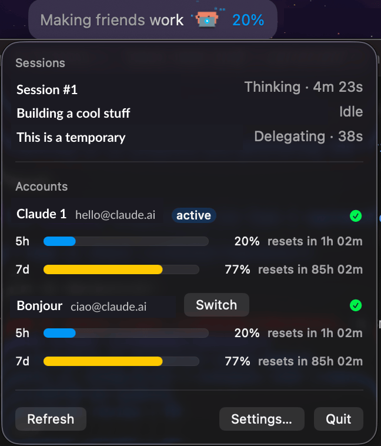

# Claude Status Bar for macOS

<p align="center">
  
</p>

[](https://github.com/juzser/claude-status-bar-macos/actions/workflows/ci.yml)

Native macOS menu bar app showing Claude usage and Claude Code activity at a
glance. A clean-room Swift port of the idea behind
[claude-status-bar-kde](https://github.com/vntrungld/claude-status-bar-kde),
with multi-account support.

<p align="center">
  
  <br><br>
  
</p>

## Features

- **Usage at a glance** — 5-hour and 7-day utilization for the active Claude
  account in the menu bar, color-coded (green / yellow ≥50% / red ≥80%,
  configurable).
- **Multi-account** — discovers every account managed by
  [cux](https://cux.inulute.com) under `~/.cux` (falls back to
  `~/.claude/.credentials.json`); per-account usage bars in the popover.
- **Claude Code activity** — Clawd shows what your sessions are doing right
  now (thinking, editing, running…), with playful verbs and elapsed timers,
  driven by Claude Code hooks + file watching (no polling loop).
- **Settings** — display style, poll interval, thresholds, per-account
  visibility, launch at login, hook install/remove.

## Install

1. **Prerequisites**
   - macOS 14 (Sonoma) or later.
   - [Claude Code](https://docs.claude.com/en/docs/claude-code) installed, if
     you want the menu bar to show live session activity (step 4 below). The
     app also works purely as a usage monitor without it.
   - Command Line Tools only if you're building from source — no full Xcode
     install needed: `xcode-select --install`.

2. **Get the app**

   Download `ClaudeStatusBar.dmg` from
   [Releases](https://github.com/juzser/claude-status-bar-macos/releases),
   open it, and drag `ClaudeStatusBar.app` to `/Applications`.

   To build from source instead (contributors, or Command-Line-Tools-only
   setups), see [Build from source](#build-from-source) below, then:

   ```sh
   cp -R dist/ClaudeStatusBar.app /Applications/
   ```

3. **First launch / Gatekeeper**

   The app is self-signed (not notarized by Apple), so macOS quarantines it
   and the first launch is refused ("cannot verify" / "damaged") — expected
   either way you installed it. Right-click the app in Applications and
   choose **Open** (twice if needed), or clear the quarantine flag directly:

   ```sh
   xattr -d com.apple.quarantine /Applications/ClaudeStatusBar.app
   ```

   The app lives in the menu bar only (no Dock icon) — look for its icon
   there after launch.

4. **Enable activity tracking**

   Settings → **Claude Code** tab → **Install**. This adds hook entries for
   `SessionStart`, `UserPromptSubmit`, `PreToolUse`, `PostToolUse`, `Stop`,
   and `Notification` to `~/.claude/settings.json` (a timestamped backup is
   written first; running Install again is safe — it replaces its own prior
   entry rather than duplicating it). **Remove** deletes exactly what
   **Install** added.

5. **Multi-account usage (optional)**

   Install [cux](https://cux.inulute.com) and add your accounts — the app
   reads account slots straight from `~/.cux` (falling back to the single
   account in `~/.claude/.credentials.json`). Each cux slot shows up as its
   own row in the popover with 5h/7d usage bars; click **Switch** to make a
   different slot active. If a row shows **re-login needed**, click
   **Log in**: for a cux slot this runs `cux switch <slot> && cux /login`,
   for the bare `~/.claude` account it runs `claude /login` — either opens a
   terminal window to complete the OAuth flow.

6. **Verify it works**

   The menu bar label shows (depending on display style): activity text
   (e.g. "Editing… · 12s"), the Clawd icon, and your active account's
   5-hour usage percentage. Click it to open the popover for per-account
   usage bars and active Claude Code sessions.

7. **Uninstall**

   Settings → **Claude Code** tab → **Remove**, quit the app (menu bar icon
   → popover → **Quit**), then delete it:

   ```sh
   rm -rf /Applications/ClaudeStatusBar.app
   ```

## Build from source

Requires macOS 14+ and Command Line Tools (no Xcode needed).

```sh
make build   # debug build
make test    # unit + integration tests
make app     # dist/ClaudeStatusBar.app
make dmg     # dist/ClaudeStatusBar.dmg
```

`make app` signs the app with a self-signed "ClaudeStatusBar Local Signing"
identity, generating it into your login keychain on first run if it doesn't
already exist (`scripts/ensure-signing-identity.sh`). Keeping this identity
stable across rebuilds — rather than ad-hoc signing, which re-derives its
identity from the binary's own bytes every build — is what lets macOS
Keychain "Always Allow" grants (e.g. for cux account credentials) survive
rebuilding and reinstalling the app.

## Security notes

- OAuth tokens are read from disk only at request time and sent only to
  `api.anthropic.com`. They are never logged, cached, or written elsewhere.
- The app is not sandboxed (it must read `~/.claude` and `~/.cux`).
- The hook binary always exits 0 and prints nothing, so it can never block
  or corrupt a Claude Code session.

## Contributing

Contributions are welcome. See [CONTRIBUTING.md](CONTRIBUTING.md) for the
build/test/PR workflow, and [CLAUDE.md](CLAUDE.md) if you're using Claude
Code (or another AI coding agent) to work in this repo.

## License

MIT. Clawd artwork from
[clawd-tank](https://github.com/marciogranzotto/clawd-tank) (MIT) — see
`LICENSE.clawd-tank`.
